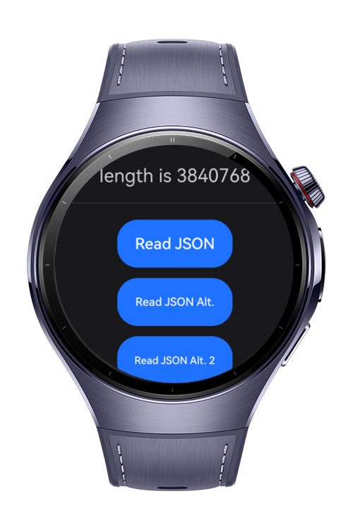

> **Note:** To access all shared projects, get information about environment setup, and view other guides, please visit [Explore-In-HMOS-Wearable Index](https://github.com/Explore-In-HMOS-Wearable/hmos-index).

# How to Read Raw files

This codelab demonstrates an application that will read raw files and input the length value. These include JSON and
.mp3 files.

# Preview

<div>
    
    
</div>

# Use Cases

- Read raw files

# Tech Stack

* Languages: ArkTS, ArkUI
* Frameworks: HarmonyOS SDK 5.1.0(18)
* Tools: DevEco Studio Vers 5.1.0.828
* Libraries: @kit.ArkUI, @kit.BasicServicesKit, @kit.ArkTS

# Directory Structure

```
Raw file  codelab/
├── src/
│   └── main/
│       ├── ets/
│       │   ├── common/
│       │   │   ├── Constants.ets
│       │   │   └── RawFileManager.ets
│       │   ├── entryability/
│       │   │   └── EntryAbility.ets
│       │   ├── entrybackupability/
│       │   │   └── EntryBackupAbility.ets
│       │   ├── models/
│       │   │   ├── Post.ets
│       │   │   ├── Product.ets
│       │   │   └── User.ets
│       │   └── pages/
│       │       └── Index.ets
│       └── resources/
│
└── module.json5
```

# Constraints and Restrictions

## Supported Device

- Huawei Watch 5

# License

**Raw File Reading** is distributed under the terms of the MIT License.
See the [license](/LICENSE) for more information.